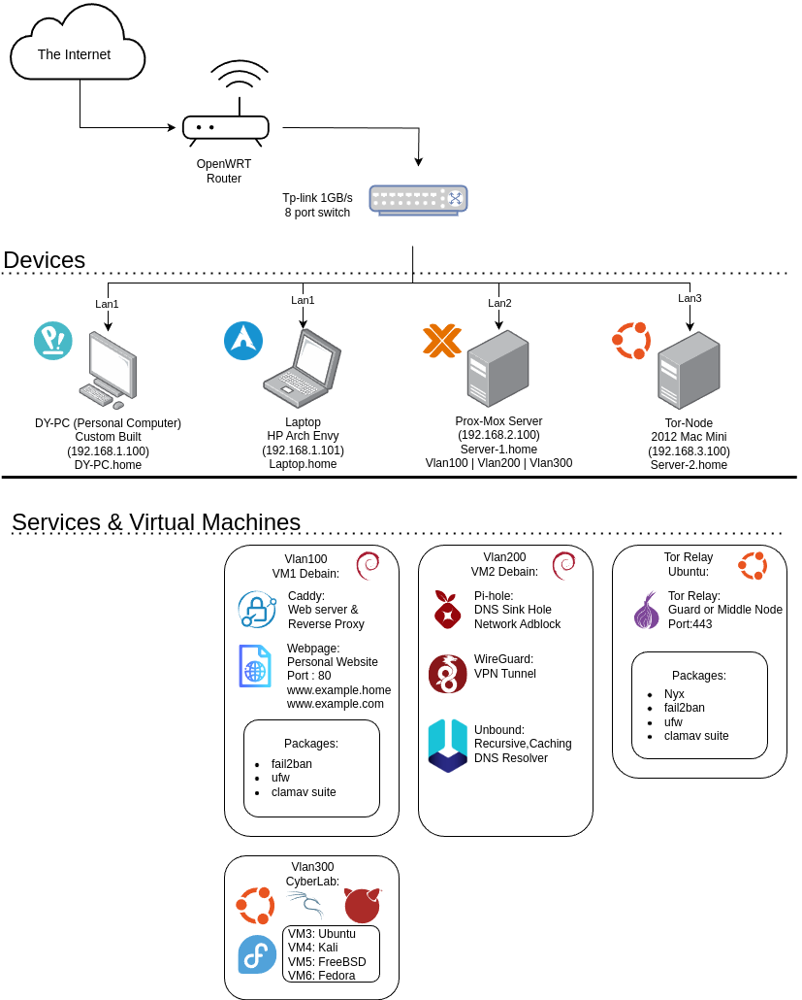

# 🏠 HomeLab Network Diagram

This repository documents the network architecture, services, and security layers of my self-hosted home lab.

---
## 🗺️ Network Diagram

---
## 📡 Network Overview

- **Router:** OpenWRT-based firewall/router with VLAN and DNS segregation
- **Switch:** TP-Link 1Gbps 8-port unmanaged switch
- **Client Devices:**
  - Personal Desktop (`DY-PC.home`)
  - Laptop (`Laptop.home`)
- **Server Nodes:**
  - **Proxmox Host** (`Server-1.home`) running multiple VMs
  - **Tor Node** (`Server-2.home`) operating a relay on port 443

---

## 🖥️ Virtual Machines by VLAN

### VLAN100 – Public Web Services
- **VM1 (Debian):**
  - [Caddy](https://caddyserver.com/): Reverse proxy + TLS
  - Static Web Page: `www.example.home`
  - **Security:** `fail2ban`, `ufw`, `clamav`

### VLAN200 – Network Privacy
- **VM2 (Debian):**
  - [Pi-hole](https://pi-hole.net/): DNS sinkhole + adblock
  - [WireGuard](https://www.wireguard.com/): VPN endpoint
  - [Unbound](https://www.nlnetlabs.nl/projects/unbound/): Recursive DNS

### VLAN300 – Cyber Lab
- **VM3:** Ubuntu
- **VM4:** Kali Linux
- **VM5:** FreeBSD
- **VM6:** Fedora

> For experimentation, penetration testing, and cross-platform testing.

---

## 🧅 Tor Relay Node
- **Standalone Mac Mini**
  - OS: Ubuntu
  - Role: Guard or Middle Node
  - Port: `443`
  - Packages: `nyx`, `fail2ban`, `ufw`, `clamav`

---

## 🔐 Security Considerations

- VLAN segmentation limits attack surface
- DNS over TLS via Unbound
- Firewall (`ufw`) and brute-force protection (`fail2ban`)
- Antivirus scanning via ClamAV
- Isolated guest WiFi for IoT devices (not shown)

---

## 📂 Files

| File                        | Description                           |
|----------------------------|---------------------------------------|
| `Network-Diagram.drawio.png` | Rendered diagram of network topology |
| `Network-Diagram.drawio`     | Source file for editing via draw.io  |

---

## 🛠️ Future Plans

- Monitoring with Prometheus + Grafana
- Self-hosted Git (e.g., Gitea)
- Immutable OS testing in lab (e.g., Fedora Silverblue, Vanilla OS)

---

## 📘 License

This project is licensed under the MIT License (see `LICENSE` file).
